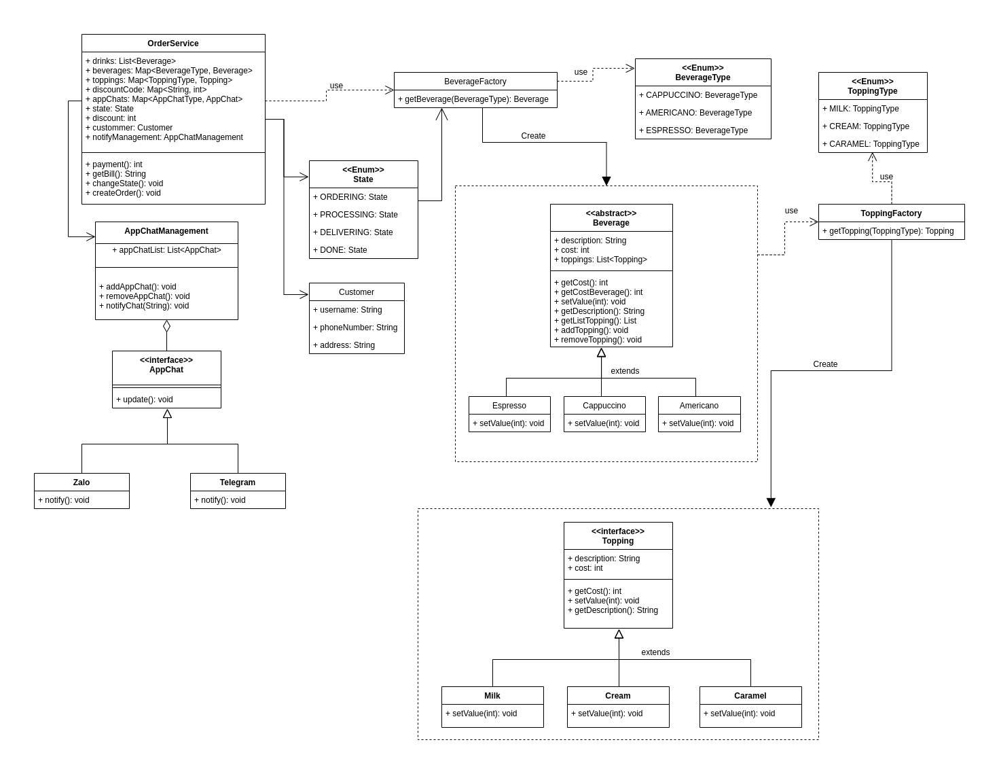

Write a program for a coffee shop (using Design Patterns and Unit Testing)

## Analysis

What does a coffee shop app need?

- Customers can choose beverages: many kinds, many quantities,...
- Each beverage can be added with many toppings
  Customer needs to be sent the order status
- Order status can be sent to chat apps (telegram, zalo, ...)
- Bill can be printed or sent to chat apps (telegram, zalo, ...)
- An order has many items, states, total money, customer information
  ...

## Solution

- Use factory method pattern to choose beverage and initialization topping.
- Use observer pattern to send automatic notifications when order changes.
- Use JUnit for Unit Testing.
- New login can create an order.

## Techniques

- Design pattern: Factory method, Observer.
- Database: file .txt
- JUnit
- Mockito
- Application type: Console
- Input: interactive

Class diagram for real solution:

